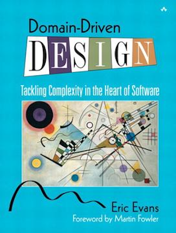

[](https://gitpitch.com/enogrob/ebook-project/master)
```
Roberto Nogueira  
BSd EE, MSd CE
Solution Integrator Experienced - Certified by Ericsson
```
# eBook project



**About**

Learn everything you need to about the subject of this `eBook` project.

[Homepage](https://www.safaribooksonline.com/library/view/domain-driven-design-tackling/0321125215/)

## Topics
```
[ ] Title Page
[ ] Copyright Page
[ ] Praise for Domain-Driven Design
[ ] Dedication Page
[ ] Contents
[ ] Foreword
[ ] Preface
Acknowledgments
I: Putting the Domain Model to Work
[ ] One. Crunching Knowledge
[ ] Two. Communication and the Use of Language
[ ] Three. Binding Model and Implementation
II: The Building Blocks of a Model-Driven Design
[ ] Four. Isolating the Domain
[ ] Five. A Model Expressed in Software
[ ] Six. The Life Cycle of a Domain Object
[ ] Seven. Using the Language: An Extended Example
III: Refactoring Toward Deeper Insight
[ ] Eight. Breakthrough
[ ] Nine. Making Implicit Concepts Explicit
[ ] Ten. Supple Design
[ ] Eleven. Applying Analysis Patterns
[ ] Twelve. Relating Design Patterns to the Model
[ ] Thirteen. Refactoring Toward Deeper Insight
IV: Strategic Design
[ ] Fourteen. Maintaining Model Integrity
[ ] Fifteen. Distillation
[ ] Sixteen. Large-Scale Structure
[ ] Seventeen. Bringing the Strategy Together
Conclusion
[ ] Appendix. The Use of Patterns in This Book
[ ] Glossary
[ ] References
[ ] Photo Credits
[ ] Index
Footnotes
[ ] Chapter 1
[ ] Chapter 5
[ ] Chapter 6
[ ] Part III
[ ] Chapter 10
[ ] Chapter 14
[ ] Chapter 16
```
